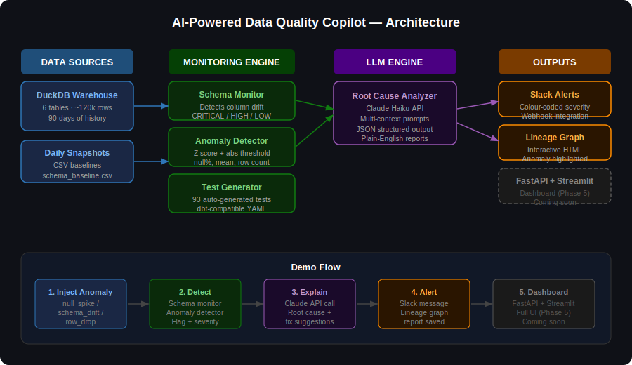

# 🚀 AI-Powered Data Quality Copilot

> **"ChatGPT for broken data pipelines"** — monitors tables, detects anomalies automatically, and uses an LLM to explain WHY something broke and how to fix it.



---

## The Problem

Pipelines break silently. Bad data flows downstream. Nobody knows until dashboards are wrong — and by then, business decisions have already been made on corrupt data.

Tools like dbt and Airflow give you logs and basic tests, but engineers still spend hours manually tracing root causes.

## The Solution

An AI copilot that:
- Monitors your tables daily for schema drift and statistical anomalies
- Automatically generates data quality tests from historical patterns
- Uses Claude AI to explain root causes in plain English
- Sends colour-coded Slack alerts with fix suggestions
- Visualises pipeline dependencies with an interactive lineage graph

---

## Demo

**Inject a failure → detect it → explain it → alert:**

```bash
python tests/inject_anomaly.py --scenario null_spike
python src/llm/root_cause_analyzer.py
python src/alerts/slack_alerts.py
python tests/inject_anomaly.py --reset
```

**Example LLM output:**

```
🔴 [CRITICAL] payments.amount — null_pct

📢 What happened:
   The payments.amount column is unexpectedly null in 44.85% of records,
   a dramatic shift from the historical baseline of 0% nulls.

🔍 Root cause:
   Payment processing pipeline is inserting records with NULL amounts,
   likely due to upstream data source failure or a recent deployment
   that removed amount validation before insert.

🔧 Suggested fixes:
   1. Query payments table for records inserted in last 24 hours with
      NULL amount and cross-reference transaction logs
   2. Review recent git commits for logic changes affecting amount
      column population
   3. Add NOT NULL constraint to payments.amount and implement
      pre-insertion validation
```

---

## Features

| Feature | Description |
|---|---|
| Schema drift detection | Catches renamed, dropped, or type-changed columns |
| Anomaly detection | Z-score + absolute threshold on null %, row count, mean, std |
| Auto test generator | Generates 93 dbt-compatible tests from 30-day data profiles |
| LLM root-cause engine | Claude API with multi-context prompts — anomaly + schema drift |
| Slack alerts | Colour-coded severity alerts with fix suggestions |
| Lineage graph | Interactive HTML graph, anomalous nodes highlighted in red |

---

## Quick Start

### 1. Clone and set up environment

```bash
git clone https://github.com/yourusername/data-quality-copilot
cd data-quality-copilot

python -m venv venv
source venv/bin/activate        # Mac/Linux
venv\Scripts\activate           # Windows

pip install -r requirements.txt
```

### 2. Add your API keys

Create a `.env` file in the project root:

```
ANTHROPIC_API_KEY=your_key_here
SLACK_WEBHOOK_URL=https://hooks.slack.com/services/XXX/YYY/ZZZ
```

Get your Anthropic API key at [console.anthropic.com](https://console.anthropic.com).
Get your Slack webhook at [api.slack.com/apps](https://api.slack.com/apps).

### 3. Generate the warehouse

```bash
python data/generate_data.py
```

This creates `data/warehouse.duckdb` with 6 tables and ~120k rows of synthetic e-commerce data, plus 90 days of metric snapshots.

### 4. Run the monitoring engine

```bash
# Schema monitor
python src/monitoring/schema_monitor.py

# Anomaly detector
python src/monitoring/anomaly_detector.py

# Auto test generator
python src/monitoring/test_generator.py
```

### 5. Run the full AI pipeline

```bash
python src/llm/root_cause_analyzer.py
python src/alerts/slack_alerts.py
python src/lineage/lineage_graph.py
open data/lineage_graph.html
```

---

## Anomaly Injection (Demo & Testing)

Inject realistic pipeline failures to test the monitoring engine:

```bash
python tests/inject_anomaly.py --list               # see all scenarios

python tests/inject_anomaly.py --scenario schema_drift        # renames order_status → status
python tests/inject_anomaly.py --scenario null_spike          # 45% of payment amounts go null
python tests/inject_anomaly.py --scenario row_drop            # 35% of orders deleted
python tests/inject_anomaly.py --scenario distribution_shift  # order totals triple
python tests/inject_anomaly.py --scenario new_bad_values      # unknown product categories
python tests/inject_anomaly.py --scenario duplicate_rows      # 20% of items duplicated

python tests/inject_anomaly.py --reset              # restore clean data
```

---

## Project Structure

```
data-quality-copilot/
├── data/
│   ├── generate_data.py          # synthetic warehouse generator
│   ├── warehouse.duckdb          # DuckDB database (gitignored)
│   └── snapshots/                # daily metric baselines + drift history
├── src/
│   ├── monitoring/
│   │   ├── schema_monitor.py     # schema drift detection
│   │   ├── anomaly_detector.py   # statistical anomaly detection
│   │   └── test_generator.py     # auto data quality test generation
│   ├── llm/
│   │   └── root_cause_analyzer.py # Claude API root-cause engine
│   ├── alerts/
│   │   └── slack_alerts.py       # Slack webhook alerts
│   ├── lineage/
│   │   └── lineage_graph.py      # interactive pipeline lineage graph
│   └── api/                      # FastAPI backend (Phase 5)
├── frontend/                     # Streamlit dashboard (Phase 5)
├── tests/
│   └── inject_anomaly.py         # anomaly injection for demos + testing
├── .env                          # API keys (never commit this)
├── .gitignore
└── requirements.txt
```

---

## Tech Stack

| Layer | Technology |
|---|---|
| Data warehouse | DuckDB |
| Data processing | Python, Pandas, NumPy |
| Anomaly detection | Scipy (Z-score), custom thresholds |
| LLM | Anthropic Claude Haiku |
| Alerts | Slack Incoming Webhooks |
| Lineage graph | NetworkX, Pyvis |
| API | FastAPI (Phase 5) |
| Dashboard | Streamlit (Phase 5) |
| Testing | Pytest |

---

## How It Works

```
1. generate_data.py creates warehouse + saves 90-day metric baselines
2. schema_monitor.py compares live schema to baseline → flags drift
3. anomaly_detector.py runs Z-score on metrics → flags statistical anomalies
4. root_cause_analyzer.py sends anomaly + drift context to Claude API
5. Claude returns structured JSON: explanation + root_cause + fixes
6. slack_alerts.py formats and sends to your Slack channel
7. lineage_graph.py renders interactive graph with anomalous nodes in red
```

---

## Roadmap

- [x] Phase 1 — Environment + synthetic data warehouse
- [x] Phase 2 — Schema monitor + anomaly detector + test generator
- [x] Phase 3 — LLM root-cause engine (Claude API)
- [x] Phase 4 — Slack alerts + lineage graph
- [ ] Phase 5 — FastAPI backend + Streamlit dashboard
- [ ] Phase 6 — Integration tests + deployment

---

## Resume Bullet

> Built an AI-powered data observability platform monitoring 6 tables daily across schema drift, statistical anomalies (Z-score + absolute thresholds), and data quality tests; integrated Claude API with multi-context prompt engineering to generate plain-English root-cause explanations and fix suggestions; deployed Slack alerting and an interactive lineage graph with real-time anomaly highlighting.

---

*Built with Python · DuckDB · Anthropic Claude · Scikit-learn · NetworkX · Pyvis*
